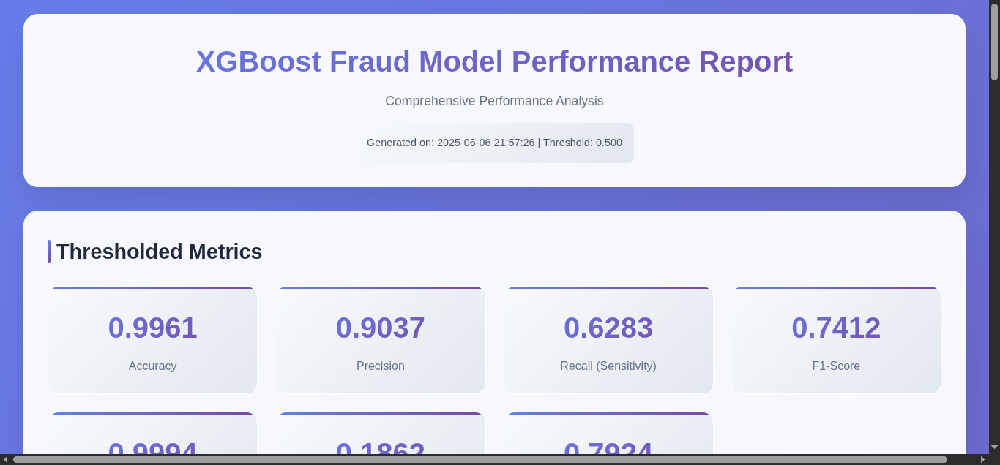
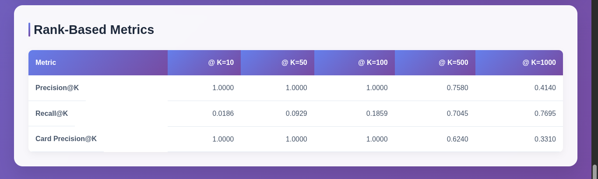
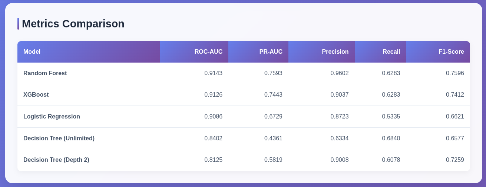
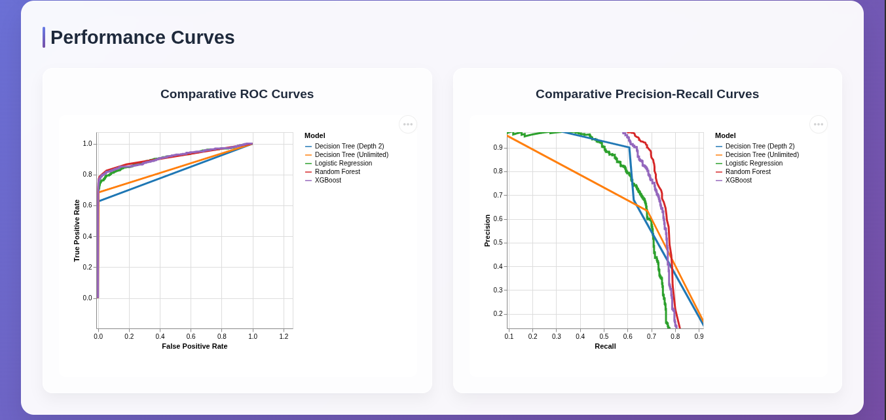

# FraudMetrics: A library for fraud detection metrics and analysis

[](https://opensource.org/licenses/MIT)

`FraudMetrics` is a Python library meticulously crafted to provide a comprehensive suite of metrics and visualizations specifically tailored for evaluating machine learning models in the domain of fraud detection. It emphasizes metrics critical for imbalanced datasets, actionable insights through rank-based and value-based evaluations, and clear visual reporting.

## Screenshots






## Features

*   **Threshold-Based Metrics:**
    *   Full Confusion Matrix components (TP, FP, FN, TN)
    *   Core classification metrics: Accuracy, Precision, Recall (Sensitivity), Specificity, F1-Score
    *   Error Rates: False Positive Rate (FPR), False Negative Rate (FNR), Classification Error
    *   Balanced metrics for imbalanced data: Balanced Error Rate (BER), G-Mean
    *   Predictive Values: Negative Predictive Value (NPV)
    *   Discovery/Omission Rates: False Discovery Rate (FDR), False Omission Rate (FOR)
*   **Threshold-Free Metrics:**
    *   Area Under the ROC Curve (AUC ROC): Overall model discrimination ability.
    *   Average Precision (AP / AUC PR): Performance summary for imbalanced classes, focusing on positive class retrieval.
*   **Rank-Based Metrics (Alert Prioritization):**
    *   `precision_at_k`: Precision within the top K highest-scored alerts.
    *   `recall_at_k`: Recall achieved by reviewing the top K alerts.
    *   *(If implemented) `entity_precision_at_k` (e.g., Card Precision@K): Precision based on top K entities.*
*   **Value-Based Metrics (Quantifying Business Impact):**
    *   `value_captured_at_k`: Total monetary value of fraud caught within the top K alerts.
    *   `proportion_value_captured_at_k`: Percentage of total fraud value caught by top K alerts.
    *   `value_efficiency_at_k`: Average fraud value captured per alert investigated from the top K.
*   **Interactive Plotting Utilities (powered by Altair):**
    *   ROC Curve with AUC annotation.
    *   Precision-Recall Curve with AP and baseline annotation.
    *   Detailed Confusion Matrix Heatmap (with raw counts and normalization options).
    *   Cumulative Gains Chart (with baseline and perfect model comparison).
    *   Value Captured vs. Number of Alerts Investigated.
*   Others

## Installation

NOTE: Still in testing stage

```bash
pip install --index-url https://test.pypi.org/simple/ --extra-index-url https://pypi.org/simple fraudmetrics
```

## Dependencies

*   numpy
*   pandas
*   altair[all] # Needed for VegaFusion

## Examples

```python
import numpy as np
import pandas as pd # For creating DataFrames if needed for Altair charts outside the library
import fraudmetrics as fm
# For plotting functions, if not exposed at top level of fraudmetrics:
# from fraudmetrics.plot_curves import plot_roc_curve, plot_pr_curve, plot_confusion_matrix

# --- Sample Data ---
y_true = np.array([0, 1, 0, 1, 0, 0, 1, 1, 0, 1, 0, 1, 0, 0, 1])
y_pred_proba = np.array([0.1, 0.8, 0.3, 0.9, 0.2, 0.4, 0.7, 0.6, 0.05, 0.75, 0.15, 0.65, 0.25, 0.35, 0.85])
transaction_values = np.array([10, 100, 15, 200, 20, 5, 150, 80, 10, 90, 12, 110, 22, 30, 130]) # Example values

# --- Calculate Key Metrics ---
print("--- Core Metrics ---")
roc_auc = fm.threshold_free.get_roc_auc_score(y_true, y_pred_proba)
ap_score = fm.threshold_free.get_AP_score(y_true, y_pred_proba)
print(f"ROC AUC: {roc_auc:.4f}")
print(f"Average Precision (AP): {ap_score:.4f}")

k = 5 # Evaluate top 5 alerts
precision_k = fm.rank_based.get_precision_at_topk(y_true, y_pred_proba, k=k)
recall_k = fm.rank_based.get_recall_at_topk(y_true, y_pred_proba, k=k)
value_k = fm.value_based.value_captured_at_k(y_true, y_pred_proba, transaction_values, k=k)
print(f"\n--- Rank-Based Metrics (Top {k} Alerts) ---")
print(f"Precision@{k}: {precision_k:.4f}")
print(f"Recall@{k}: {recall_k:.4f}")
print(f"Value Captured@{k}: ${value_k:.2f}")

# --- Generate and Display Plots ---
print("\n--- Generating Plots (example: ROC Curve) ---")

# Or if exposed at top level:
roc_chart = fm.plot_curves.plot_roc_curve(y_true, y_pred_proba, title="Sample ROC Curve")

# To display in Jupyter or save:
# roc_chart.show() 
roc_chart.save("example_roc_curve.html") 
print("ROC Curve saved to example_roc_curve.html")

# Example: Precision-Recall Curve
pr_chart = fm.plot_curves.plot_pr_curve(y_true, y_pred_proba, title="Sample Precision-Recall Curve")
pr_chart.save("example_pr_curve.html")
print("PR Curve saved to example_pr_curve.html")

# Example: Confusion Matrix (requires a threshold)
threshold = 0.6
cm_components = fm.thresholded.get_binary_confusion_matrix(y_true, y_pred_proba, threshold=threshold)
cm_chart = fm.plot_curves.plot_confusion_matrix(cm_components, 
                                   class_names=["Non-Fraud", "Fraud"], 
                                   title=f"Confusion Matrix (Threshold={threshold})")
cm_chart.save("example_confusion_matrix.html")
print(f"Confusion Matrix plot saved to example_confusion_matrix.html (Components: {cm_components})")
```

## LICENSE

